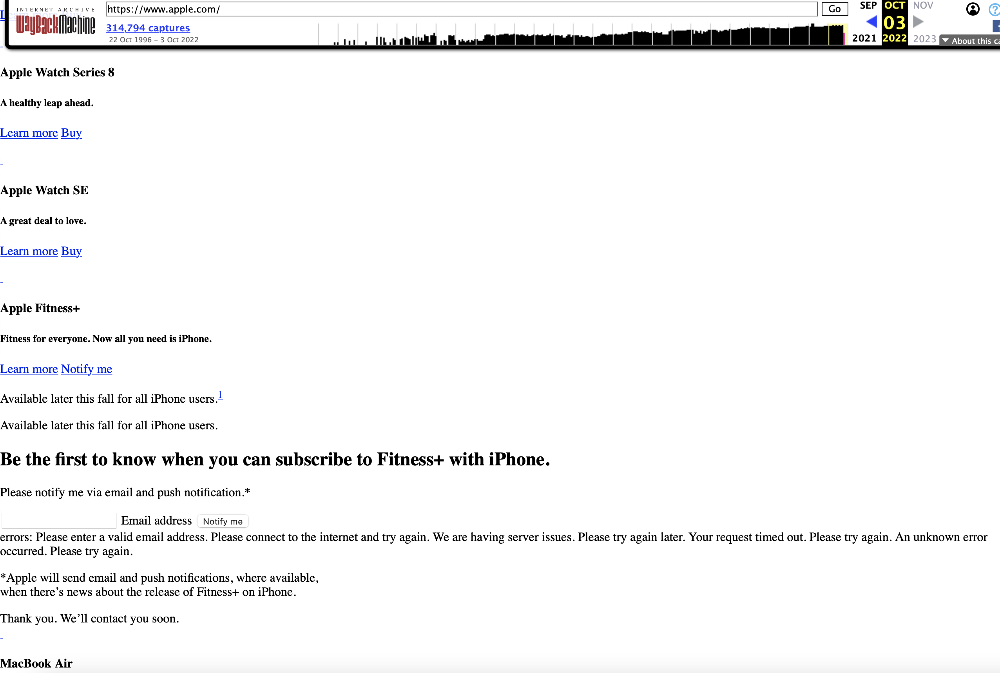

Using the Wayback Machine, I visited Apple's old website. The website was from the year 1996. The older version is completely HTMl and looks very similar to the early stages of the websites we are currently learning to build. The older version has no pictures, just links. There are a lot of errors, and the website is not as functional as the current one. Apple is known for its usability and creative website so it is crazy to see the difference a couple decades can make.

