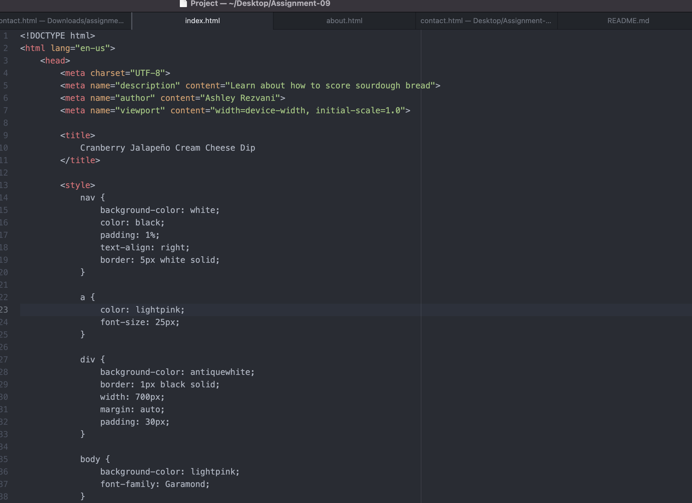

When learning HTML, it is confusing at first to get all the right code in order. The hardest part for me is the small details. Also knowing what abbreviations mean is difficult for me.

I have never used CSS (besides this class) so I am excited to gain another skill!

